# Architecture

Terraform-managed AWS identity platform with centralized access control across multiple accounts.

## Overview

```mermaid
graph TB
    subgraph "Master Account"
        ORG[AWS Organizations]
        IDC[IAM Identity Center]
    end

    subgraph "Development OU"
        SANDBOX[Sandbox-Dev Account]
        PROD[Prod Account]
        AUDIT[Audit Account]
    end

    ORG --> SANDBOX
    ORG --> PROD
    ORG --> AUDIT
    IDC --> SANDBOX
    IDC --> PROD
    IDC --> AUDIT

    style ORG fill:#ff9900
    style IDC fill:#232f3e
```



## Components

### AWS Organizations

**Structure**:

- Master account
- Development OU containing:
  - Sandbox-Dev account
  - Prod account
  - Audit account

**Configuration**:

- Feature set: ALL
- Service access: sso.amazonaws.com enabled
- Accounts defined in `locals.tf`

### IAM Identity Center

**Users** (defined in `config/users.yaml`):

- dereban (SuperAdmins)
- alice (PlatformAdmins)
- bob, johndoe (Developers)
- carol (DevOpsEngineers)
- dan (SecurityAuditors)

**Groups** (defined in `config/groups.yaml`):

- SuperAdmins: Full access to all accounts
- PlatformAdmins: Full access to all accounts
- Developers: Developer access to Sandbox-Dev, read-only to Prod
- DevOpsEngineers: Infrastructure admin for Sandbox-Dev and Prod
- SecurityAuditors: Read-only access across all accounts

**Permission Sets** (defined in `config/permission_sets.yaml`):

- AdministratorAccess: Full admin (8h session)
- DeveloperAccess: App development (4h session, custom policy)
- InfrastructureAdmin: Infrastructure management (4h session, custom policy)
- SecurityAuditor: Security audit only
- SecurityAuditorFull: Security audit + read-only

**Account Assignments** (defined in `config/account_assignments.yaml`):

- Declarative mappings between groups, accounts, and permission sets
- Managed through YAML for easy updates

## Security Model

### Principles

- **Least Privilege**: Role-based access with minimal required permissions
- **Separation of Duties**: Distinct groups for development, operations, and security
- **Account Isolation**: Workload separation at account level
- **Declarative Configuration**: All access defined as code and version-controlled

### Access Patterns

| Role              | Sandbox-Dev        | Prod                     | Audit                 |
| ----------------- | ------------------ | ------------------------ | --------------------- |
| SuperAdmins       | Administrator      | Administrator            | Administrator         |
| PlatformAdmins    | Administrator      | Administrator            | Administrator         |
| Developers        | DeveloperAccess    | SecurityAuditorFull      | -                     |
| DevOpsEngineers   | InfrastructureAdmin| InfrastructureAdmin      | -                     |
| SecurityAuditors  | SecurityAuditorFull| SecurityAuditorFull      | SecurityAuditorFull   |

## Module Structure

```bash
modules/
├── organization/
│   ├── main.tf           # Organization and OU management
│   ├── variables.tf      # Module inputs
│   └── outputs.tf        # Account IDs and OU details
└── identity_center/
    ├── main.tf           # Users, groups, permission sets
    ├── variables.tf      # Module inputs
    └── outputs.tf        # Identity Center details
```

### Root Module

```bash
.
├── main.tf               # Module orchestration
├── locals.tf             # Data transformations and YAML parsing
├── variables.tf          # Environment variables (emails)
├── outputs.tf            # Final outputs
├── data.tf               # SSO instance data source
├── providers.tf          # AWS provider configuration
├── versions.tf           # Terraform and provider versions
├── backend.tf            # State backend configuration
└── config/
    ├── users.yaml
    ├── groups.yaml
    ├── permission_sets.yaml
    └── account_assignments.yaml
```

## Data Flow

1. **YAML Configuration**: Users, groups, permission sets, and assignments defined in YAML files
2. **locals.tf**: Parses YAML files and transforms data into Terraform structures
3. **Modules**: Organization module creates accounts, Identity Center module creates users/groups/assignments
4. **Outputs**: Provides Identity Center portal URL and resource summaries

## Configuration Management

### Adding a User

1. Add user to `config/users.yaml`
2. Add user to appropriate group in `config/groups.yaml`
3. Run `terraform plan` and `terraform apply`

### Adding a Permission Set

1. Define permission set in `config/permission_sets.yaml`
2. Add assignments in `config/account_assignments.yaml`
3. Apply changes with Terraform

### Modifying Access

1. Update `config/account_assignments.yaml`
2. Apply with Terraform - assignments will be added/removed as needed
