# AWS Identity Platform - Architecture

> **Enterprise-grade centralized identity and access management for multi-account AWS environments using Infrastructure as Code principles.**

## Architecture Overview

This platform provides secure, scalable identity management across AWS Organizations with IAM Identity Center (SSO) integration. Built on AWS Well-Architected Framework principles with security-first design.

```mermaid
graph TB
    subgraph "Master Account"
        ORG[AWS Organizations]
        IDC[IAM Identity Center]
        SCP[Service Control Policies]
    end

    subgraph "Development Environment"
        DEV[Dev Account]
        DEV_BASE[Account Baseline]
    end

    subgraph "Production Environment"
        PROD[Prod Account]
        PROD_BASE[Account Baseline]
    end

    ORG --> DEV
    ORG --> PROD
    IDC --> DEV
    IDC --> PROD
    SCP --> DEV
    SCP --> PROD

    style ORG fill:#ff9900
    style IDC fill:#232f3e
    style SCP fill:#ff4b4b
```



## Core Components

### 1. AWS Organizations Structure

**Purpose**: Centralized management and governance across multiple AWS accounts

**Key Features**:

- **Root OU**: Management account with billing and organizational control
- **Development OU**: Non-production workloads with relaxed policies
- **Production OU**: Production workloads with strict governance controls
- **Service Control Policies**: Preventive guardrails enforcing security boundaries

**Design Decisions**:

- Account isolation for workload separation and cost allocation
- OU-based policy inheritance for consistent governance
- Cross-account roles for controlled resource access

### 2. IAM Identity Center (SSO)

**Purpose**: Single sign-on and centralized permission management

**Key Features**:

- **Permission Sets**: Role-based access with least privilege principles
- **User Groups**: Organized access control (Admins, Developers, Read-only)
- **Multi-Account Access**: Seamless cross-account role assumption
- **External IdP Integration**: SAML 2.0 federation support

**Permission Model**:

```txt
Admins → Admin Access Permission Set → Full account access
Developers → Developer Access Permission Set → Development resources
Viewers → Read-only Access Permission Set → View-only access
```

### 3. Account Baseline

**Purpose**: Standardized security configuration for new AWS accounts

**Key Features**:

- **CloudTrail**: Comprehensive audit logging
- **Config**: Configuration compliance monitoring
- **GuardDuty**: Threat detection and security monitoring
- **IAM Policies**: Baseline security and access controls

### 4. Permission Management

**Purpose**: Automated access control and lifecycle management

**Key Features**:

- **Policy Automation**: Terraform-managed permission sets
- **Access Reviews**: Regular permission auditing workflows
- **Temporary Access**: Time-bound elevated permissions
- **Compliance Reporting**: Automated access compliance checks

## Security Architecture

### Zero Trust Principles

- **Identity Verification**: Multi-factor authentication required for all users
- **Least Privilege**: Minimal necessary permissions with regular reviews
- **Network Segmentation**: Account-level isolation with controlled access
- **Continuous Monitoring**: Real-time security event detection and response

### Threat Model

| Threat               | Mitigation               | Implementation                   |
| -------------------- | ------------------------ | -------------------------------- |
| Privilege Escalation | Service Control Policies | `policies/service_control/`      |
| Unauthorized Access  | MFA + Identity Center    | `modules/identity_center/`       |
| Data Exfiltration    | CloudTrail + GuardDuty   | `modules/account_baseline/`      |
| Insider Threats      | Regular Access Reviews   | `modules/permission_management/` |

### Compliance Alignment

- **SOC 2**: Access controls and audit logging
- **ISO 27001**: Information security management system
- **NIST CSF**: Cybersecurity framework implementation
- **AWS Well-Architected**: Security pillar best practices

## Infrastructure as Code

### Module Architecture

```bash
modules/
├── organization/           # AWS Organizations management
│   ├── main.tf             # Organization and OU structure
│   ├── scp.tf              # Service Control Policies
│   └── accounts.tf         # Member account management
├── identity_center/        # IAM Identity Center configuration
│   ├── main.tf             # SSO instance and configuration
│   ├── permission_sets.tf  # Permission set definitions
│   └── assignments.tf      # User/group assignments
├── account_baseline/       # Standard account configuration
│   ├── main.tf             # Core security services
│   ├── cloudtrail.tf       # Audit logging
│   └── monitoring.tf       # Security monitoring
└── permission_management/  # Access control automation
    ├── main.tf             # Permission lifecycle management
    ├── reviews.tf          # Access review automation
    └── reporting.tf        # Compliance reporting
```

### Deployment Strategy

1. **Foundation**: Deploy AWS Organizations and core structure
2. **Identity**: Configure IAM Identity Center and permission sets
3. **Baseline**: Apply security baseline to all accounts
4. **Automation**: Enable permission management and monitoring

### Testing Approach

- **Unit Tests**: Terraform module validation (`*.tftest.hcl`)
- **Integration Tests**: Cross-module functionality verification
- **Security Tests**: Policy and permission validation
- **Compliance Tests**: Regulatory requirement verification

## Operational Excellence

### Monitoring and Alerting

- **CloudTrail**: API activity and access logging
- **CloudWatch**: Metrics and operational dashboards
- **GuardDuty**: Security threat detection
- **Config**: Configuration drift detection

### Automation Workflows

- **Account Provisioning**: Automated new account setup
- **Permission Reviews**: Quarterly access certification
- **Compliance Scanning**: Continuous policy validation
- **Incident Response**: Automated security event handling

### Disaster Recovery

- **Multi-Region**: Identity Center deployment across regions
- **Backup Strategy**: Configuration and policy versioning
- **Recovery Procedures**: Documented restoration processes
- **Business Continuity**: Alternative access mechanisms

## Cost Optimization

### Resource Management

- **Right-sizing**: Appropriate service tiers for organization size
- **Usage Monitoring**: Identity Center and SSO usage tracking
- **Cost Allocation**: Account-level billing and reporting
- **Optimization**: Regular review of unused permissions and accounts

### Scaling Considerations

- **User Growth**: Horizontal scaling with user group management
- **Account Expansion**: Automated OU and account provisioning
- **Performance**: Optimized permission set and policy design
- **Regional Expansion**: Multi-region identity deployment patterns

## Implementation Roadmap

### Phase 1: Foundation (Weeks 1-2)

- [ ] Deploy AWS Organizations structure
- [ ] Configure master account security baseline
- [ ] Establish initial Service Control Policies
- [ ] Set up Terraform state management

### Phase 2: Identity (Weeks 3-4)

- [ ] Deploy IAM Identity Center
- [ ] Configure core permission sets
- [ ] Create initial user groups and assignments
- [ ] Test cross-account access workflows

### Phase 3: Governance (Weeks 5-6)

- [ ] Deploy account baseline to all accounts
- [ ] Enable monitoring and alerting
- [ ] Configure compliance reporting
- [ ] Implement access review processes

### Phase 4: Automation (Weeks 7-8)

- [ ] Enable permission management automation
- [ ] Set up CI/CD for infrastructure changes
- [ ] Configure advanced monitoring and alerting
- [ ] Conduct security and compliance validation

## Architecture Decision Records

Key architectural decisions documented in `/docs/decisions/`:

- **ADR-001**: AWS Organizations OU Structure Design
- **ADR-002**: IAM Identity Center vs AWS SSO Migration
- **ADR-003**: Permission Set Granularity Strategy
- **ADR-004**: Cross-Account Role Naming Convention
- **ADR-005**: Service Control Policy Implementation Approach
